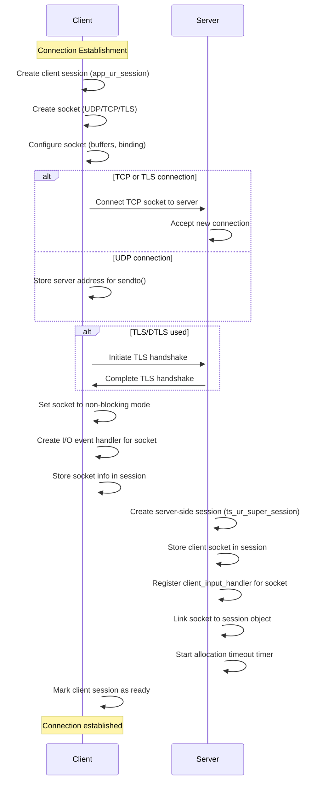
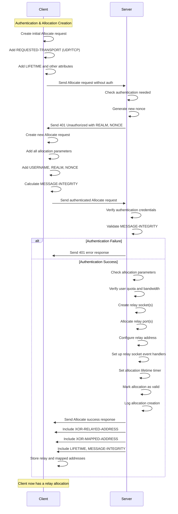
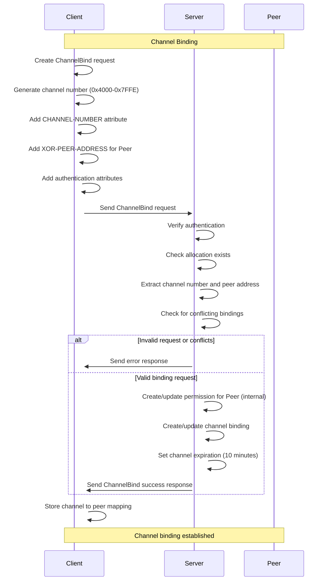
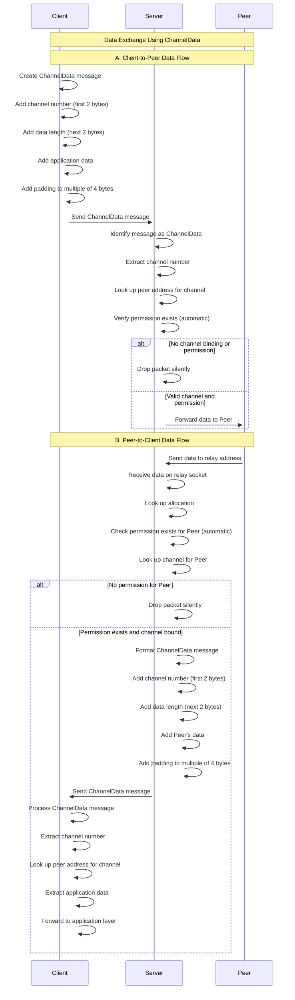
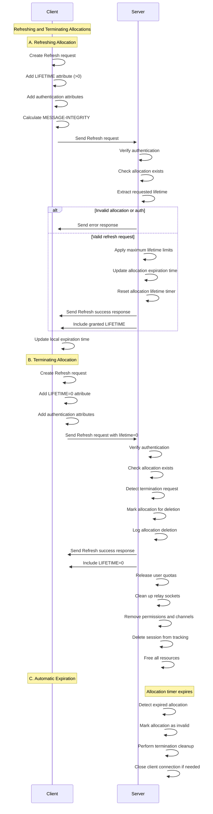

## 1. Connection Establishment Sequence Diagram

## 2. Authentication and Allocation Creation Sequence Diagram

## 3. Channel Binding Sequence Diagram

## 4. Data Exchange Using ChannelData Sequence Diagram

## 5. Refreshing and Terminating Allocations Sequence Diagram

